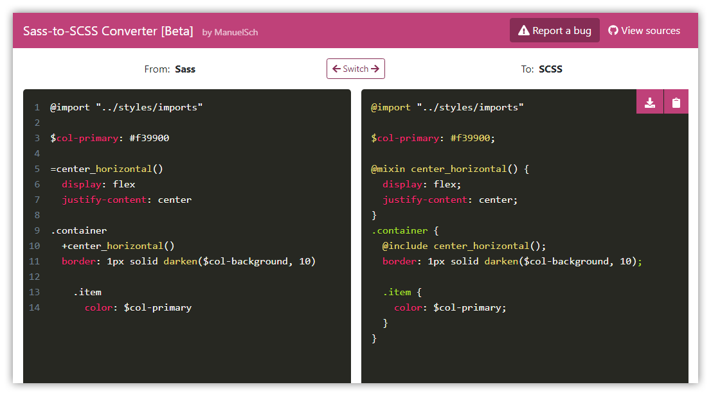

# Online Sass-to-SCSS Converter [Beta]

A small online tool that allows you to convert Sass (indented syntax) to SCSS (CSS-like syntax) and vice versa.

### Visit the web app: https://sass-scss-converter.netlify.app

 

## Keywords:
Convert Sass to SCSS, Convert SCSS to Sass
